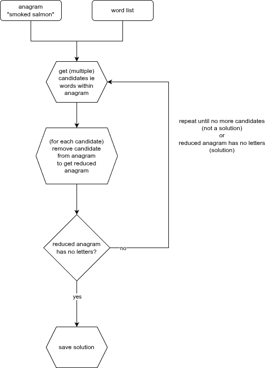
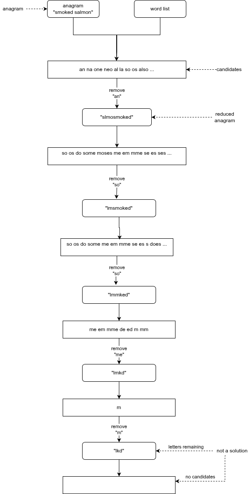
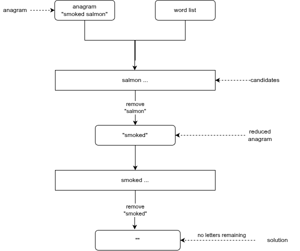

# Dean-A-Gram - The Anagram Solver

According to [Wikipedia](https://en.wikipedia.org/wiki/Anagram):

    "An anagram is a word or phrase formed by rearranging the letters of a
    different word or phrase, typically using all the original letters exactly
    once."

## Examples

<details>
    <summary>Satrical</summary>

### Satrical

* "New York Times" = "monkeys write"
* "Church of Scientology" = "rich-chosen goofy cult"
* "McDonald's restaurants" = "Uncle Sam's standard rot"

</details>

<details>
    <summary>Synonyms</summary>

### Synonyms

* "evil" = "vile"
* "a gentleman" = "elegant man"
* "silent" = "listen"
* "eleven plus two" = "twelve plus one"
* "angered" = "enraged"
* "the eyes" = "they see"

</details>

<details>
    <summary>Antonyms</summary>

### Antonyms aka antigrams

* "restful" = "fluster"
* "cheater" = "teacher"
* "funeral" = "real fun"
* "adultery" = "true lady"
* "forty five" = "over fifty"
* "Santa" = "Satan"

</details>

<details>
    <summary>Proper nouns</summary>

### Proper nouns or names

* "William Shakespeare" = "I am a weakish speller"
* "Madam Curie" = "Radium came"
* "George Bush" = "He bugs Gore"
* "Tom Marvolo Riddle" = "I am Lord Voldemort"
* "Jim Morrison" = "Mr Mojo Risin"[5]
* "The Morse code" = "Here come dots"

</details>

<details>
    <summary>Compund words</summary>

### [Compund words](https://en.wikipedia.org/wiki/English_compound)

* household
* blackbird
* notebook
* sunflower
* bedroom
* bandstand
* starfish
* sunflower
* girlfriend
* policeman
* football
* sunglasses
* wildflower
* blackboard
* breakwater
* underworld
* waterproof
* bittersweet
* drive-through
* over-ripe
* nosebleed
* shortcoming
* buy-bust
* undercut
* love-in
* once-over
* takeout
* forever

</details>

<details>
    <summary>Alternate solutions</summary>

### Alternate solutions

* a lamp <--> a palm
* coat <--> a cot
* tub <--> but
* shit <--> this

</details>

<details>
    <summary>Multiple solutions</summary>

## Multiple solutions

* "Tom Marvolo Lot Riddle"
    * "I am Lord Lot Voldemort"
    * "mail to Lord Voldemort"

</details>

## Prerequisites

* git
* Dotnet Core 9 or higher

## Getting started

<details>

```bash
# clone repository
git clone https://github.com/TrevorDArcyEvans/dean_a_gram.git

# build code
cd dean_a_gram/src
dotnet restore
dotnet build

# run tests
dotnet test
```

</details>

## Usage

<details>

```bash
# convert word list to a word map
./DeanAGram.Utils [path to word list file]

# example
./DeanAGram.Utils /home/trevorde/dev/anagram-solver/top-english-wordlists/top_english_adps_lower_500.txt

# output
Processing:  /home/trevorde/dev/anagram-solver/top-english-wordlists/top_english_adps_lower_500.txt
  --> /home/trevorde/dev/anagram-solver/top-english-wordlists/top_english_adps_lower_500.json in 2774 ms


# solve an anagram
./DeanAGram.CLI [Path to JSON word file] [Anagram text without spaces]

# example
./DeanAGram.CLI /home/trevorde/dev/anagram-solver/top-english-wordlists/top_english_adps_lower_500.json anklesdomoms

# output
smoked salmon 
```

</details>

## How it works

<details>

<details>
    <summary>Overview</summary>



</details>

<details>
    <summary>Unsuccessful solution</summary>



</details>

<details>
    <summary>Successful solution</summary>



</details>

</details>

## Word lists

* [English words](https://github.com/dwyl/english-words.git)
* [Top English word lists](https://github.com/david47k/top-english-wordlists.git)

## Further work
* Performance!  Performance!  Performance!
  * increase speed
  * reduce memory consumption
* curate word lists to remove spurious words

## Further information
* Websites
  * [Anagrammer](https://www.wordplays.com/anagrammer/)
  * [Anagram Solver](https://www.wordplays.com/anagram-solver)
* Code on GitHub
  * [anagram](https://github.com/gwerners/anagram.git)
  * [Anagram](https://github.com/XyLoNaMiyX/Anagram.git)
  * [Anagram-Solver](https://github.com/pratikshekhar/Anagram-Solver.git)

